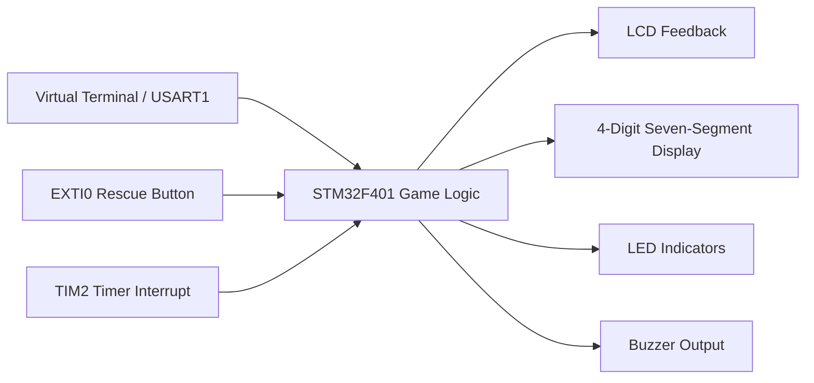

# STM32 Mastermind Game


An STM32F401 microcontroller project that turns the classic Mastermind code-breaking game into a timed bomb-defusal challenge. The repository includes the embedded firmware, Proteus simulation, project documentation, and a premium frontend-only web demo for presentation and browser-based testing.

## Plain English Summary

The player starts the game, enters a 4-digit guess, and tries to find the hidden code before the countdown reaches zero. The system gives feedback after each guess:

| Symbol | Meaning |
|---|---|
| `*` | Correct digit in the correct position |
| `+` | Correct digit in the wrong position |
| `-` | Digit is not in the code |

The game also has a rescue button that can add extra time two times. If the player guesses correctly, the game shows a win state. If time runs out, the buzzer activates and the game ends.

## Technical Summary

The firmware runs on an STM32F401VCTx and uses USART input, GPIO outputs, timer interrupts, and an external interrupt button. The project drives a character LCD, a multiplexed four-digit seven-segment display, two LEDs, and a buzzer. A static web interface in `web_demo/` mirrors the embedded logic so the project can be demonstrated without STM32CubeIDE or Proteus.

## 🌐 Web Demo

The browser demo is available in [`web_demo/`](web_demo/). It is fully frontend-only: no backend, no database, and no build step is required for normal use.

Live demo placeholder:

[https://mohadesehesmaeilzadeh.github.io/stm32-mastermind-game/web_demo/](https://mohadesehesmaeilzadeh.github.io/stm32-mastermind-game/web_demo/)

Enable GitHub Pages for the repository before using this link publicly.

### Web Interface Preview


### Interactive Simulator Preview


### Run Locally

Option 1: open [`web_demo/index.html`](web_demo/index.html) directly in a browser.

Option 2: run a local static server:

```bash
cd web_demo
python -m http.server 8080
```

Then open:

```text
http://localhost:8080
```

### Web Demo Features

- Modern dark/light interface with responsive layout
- Hero section, architecture visualization, feature cards, technology badges, workflow steps, gallery, and GitHub CTA
- Interactive USART-style terminal
- LCD feedback simulation
- Four-digit seven-segment countdown display
- STM32-style state machine: `WAIT_START`, `PLAYING`, `GAMEOVER`
- EXTI rescue button with two-use behavior
- LEDs, buzzer state, pressure meter, guess history, and feedback decoder
- Optional secret-code reveal for teaching and debugging

## Screenshots

### Proteus Simulation


## Architecture



Text-based view:

```text
Serial Terminal --> USART1 IRQ --> Game State Machine --> LCD Feedback
                                           |
EXTI Button -----> EXTI0 IRQ --------------+
                                           |
TIM2 IRQ -------> Countdown + 7-Segment ---+
                                           |
                                           +--> LEDs / Buzzer
```

## Firmware Behavior

| State | Description |
|---|---|
| `STATE_WAIT_START` | Waits for `S` or `s` from the serial terminal |
| `STATE_PLAYING` | Accepts 4-digit guesses, updates feedback, and runs countdown |
| `STATE_GAMEOVER` | Shows win/loss result and waits for restart |

## Hardware

- STM32F401VCTx microcontroller
- Character LCD in 4-bit mode
- Four-digit seven-segment display
- USART virtual terminal
- Push button connected to EXTI0
- Two LED indicators
- Buzzer or speaker output

## Pin Connections

| Module | STM32 Pin(s) | Function |
|---|---|---|
| USART1 TX/RX | PA9 / PA10 | Serial terminal communication |
| LCD RS | PC0 | LCD register select |
| LCD EN | PC1 | LCD enable |
| LCD D4-D7 | PC2-PC5 | LCD 4-bit data bus |
| Seven-segment segments | PE9-PE15 | Segment outputs |
| Seven-segment digit enables | PB8, PB9, PB10, PB12 | Digit multiplexing |
| Rescue button | PE0 | EXTI0 input |
| LED 1 | PD12 | First rescue indicator |
| LED 2 | PD13 | Second rescue indicator |
| Buzzer | PD11 | Timeout indicator |

## Project Structure

```text
.
|-- docs/
|   |-- Final_Project.pdf
|   `-- images/
|       |-- proteus-game-start.png
|       `-- proteus-win-state.png
|-- firmware/
|   `-- Mastermind_Game/
|       |-- Core/
|       |-- Drivers/
|       |-- Mastermind_Game.ioc
|       `-- STM32F401VCTX_FLASH.ld
|-- simulation/
|   `-- FINAL_PROJECT.pdsprj
|-- web_demo/
|   |-- assets/
|   |   |-- gallery/
|   |   |   |-- proteus-game-start.png
|   |   |   `-- proteus-win-state.png
|   |   `-- screenshots/
|   |       |-- screenshot-demo.png
|   |       `-- screenshot-latest.png
|   |-- scripts/
|   |   `-- capture-screenshot.mjs
|   |-- index.html
|   |-- package.json
|   |-- script.js
|   `-- style.css
|-- .gitignore
`-- README.md
```

## Build Instructions

### STM32CubeIDE

1. Open STM32CubeIDE.
2. Select `File > Import`.
3. Choose `Existing Projects into Workspace`.
4. Select the `firmware/Mastermind_Game` folder.
5. Build the project.
6. Flash the firmware to the STM32 board or use the generated output in Proteus.

### Proteus Simulation

1. Open Proteus.
2. Open `simulation/FINAL_PROJECT.pdsprj`.
3. Attach the generated firmware file if needed.
4. Start the simulation.
5. Use the virtual terminal to send `S` and 4-digit guesses.

## Deployment Guide

### GitHub Pages

1. Push the repository to GitHub.
2. Open the repository page.
3. Go to `Settings > Pages`.
4. Under `Build and deployment`, choose `Deploy from a branch`.
5. Select branch `main` and folder `/root`.
6. Save the settings.
7. Open:

```text
https://mohadesehesmaeilzadeh.github.io/stm32-mastermind-game/web_demo/
```

### Other Free Options

- Vercel: import the GitHub repository and set the output/publish directory to `web_demo`.
- Netlify: import the GitHub repository and set the publish directory to `web_demo`.

## Automatic Screenshot Update

The README always displays:

```text
web_demo/assets/screenshots/screenshot-latest.png
web_demo/assets/screenshots/screenshot-demo.png
```

When the web design changes, regenerate those files and commit them. Because the filenames stay the same, the README image automatically shows the newest version.

Install screenshot dependencies once:

```bash
cd web_demo
npm install
```

Capture fresh screenshots:

```bash
npm run screenshot
```

If Google Chrome is installed in a custom location, set `CHROME_PATH` before running the script:

```bash
CHROME_PATH="/path/to/chrome" npm run screenshot
```

## Suggested Git Commands

```bash
git status
git add .
git commit -m "Add premium web demo interface"
git push
```

For the first push to a new repository:

```bash
git init
git branch -M main
git remote add origin https://github.com/mohadesehesmaeilzadeh/stm32-mastermind-game.git
git add .
git commit -m "Initial STM32 Mastermind project"
git push -u origin main
```

## Recommended `.gitignore`

This repository already ignores common embedded, simulation, editor, and web dependency files, including:

```gitignore
Debug/
Release/
build/
out/
*.o
*.obj
*.d
*.su
*.cyclo
*.elf
*.hex
*.bin
*.map
*.list
*.srec
*.uf2
.metadata/
.settings/
RemoteSystemsTempFiles/
*.pdsbak
*.PDSPRJ.*
*.workspace
*.log
*.tmp
web_demo/node_modules/
web_demo/.cache/
web_demo/dist/
web_demo/build/
.vscode/
.idea/
.DS_Store
Thumbs.db
desktop.ini
```

## Known Improvements

- Move LCD and UART output out of interrupt handlers.
- Adjust TIM2 configuration so one displayed second equals one real second.
- Increase seven-segment refresh rate to reduce visible flicker.
- Add button debouncing for the rescue input.
- Replace hard-coded pin numbers with named constants.
- Split the firmware into separate LCD, UART, display, and game-logic modules.

## Credits

Mohadeseh Esmaeilzadeh.

Developed for a microcontroller/microprocessor course using STM32CubeIDE, Proteus, and a frontend-only JavaScript web demo.
