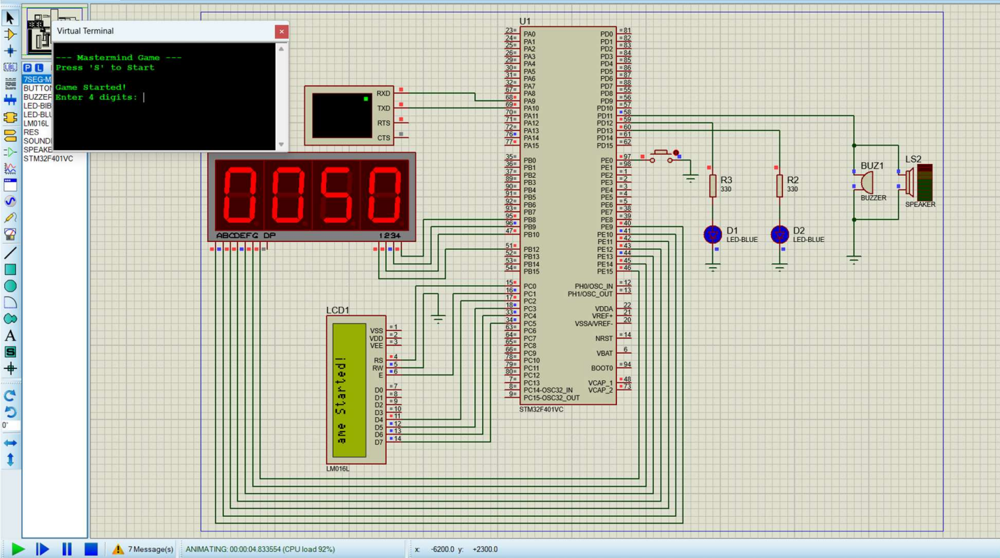
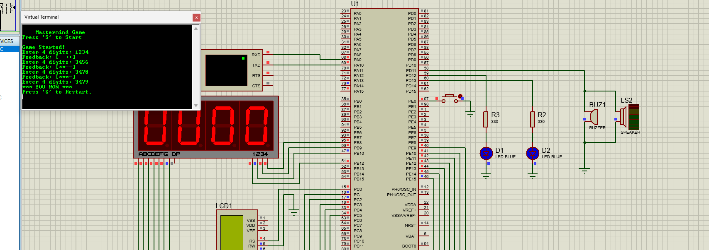
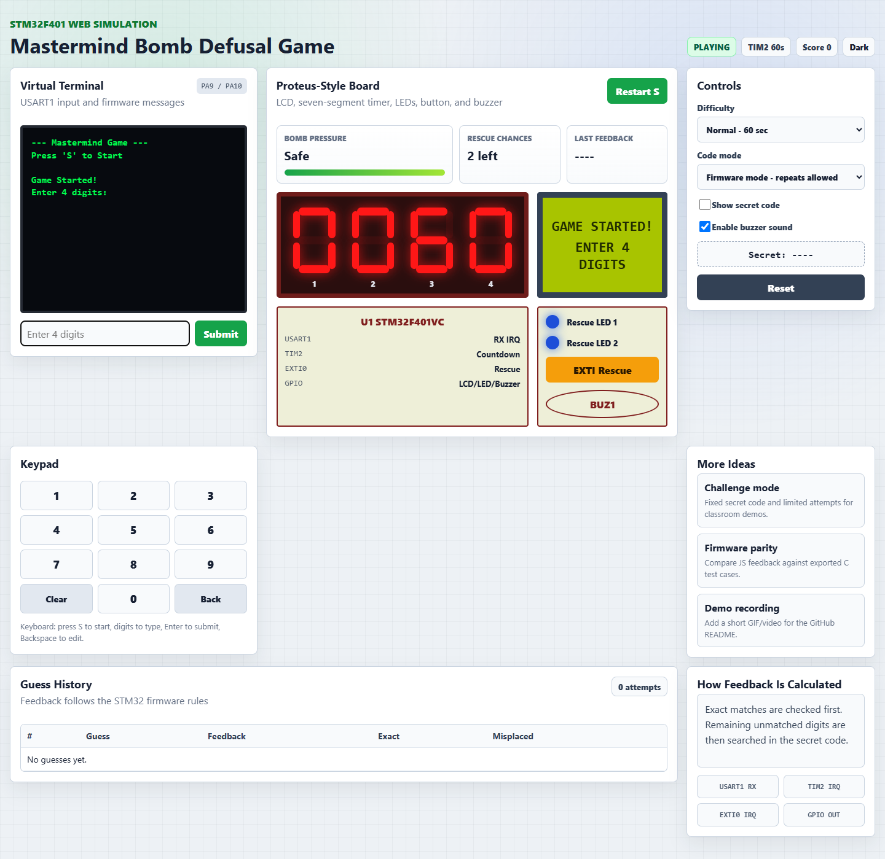
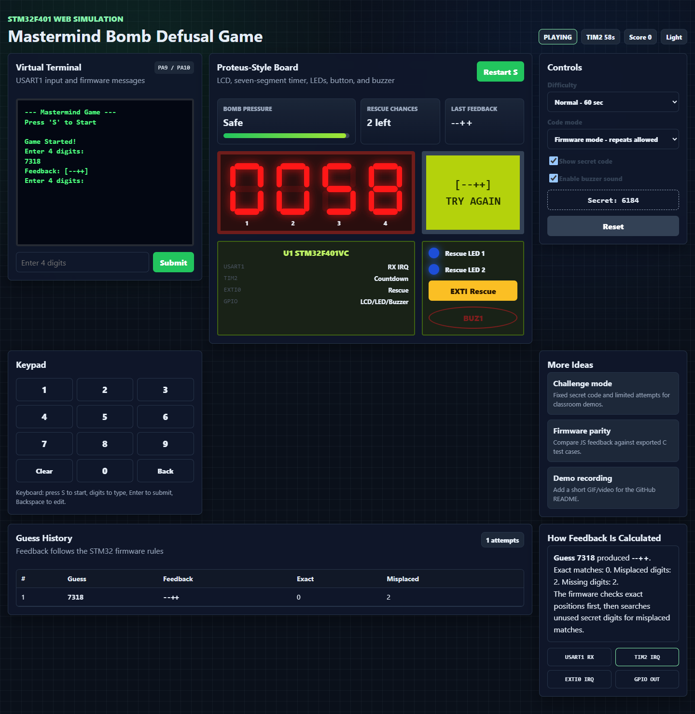

# STM32 Mastermind Game


## Overview

This project implements a Mastermind-style bomb defusal game on an STM32F401 microcontroller. The player starts the game from a serial terminal, guesses a hidden 4-digit code, and receives feedback on an LCD. A seven-segment display shows the remaining countdown time. An external interrupt button gives limited bonus time, while LEDs and a buzzer indicate game status.





## Features

- STM32F401VCTx firmware written in C
- USART1 serial input for start command and guesses
- 4-digit secret code generation
- LCD feedback using `*`, `+`, and `-`
- Multiplexed four-digit seven-segment countdown display
- External interrupt rescue button
- Two limited bonus-time chances
- Win state with `YOU WON`
- Timeout state with `BOOM`
- Proteus simulation project included
- Frontend-only JavaScript web demo included

## Web Demo

A browser version of the game is included in [`web-demo/`](web-demo/). It does not need a backend or database.

Open [`web-demo/index.html`](web-demo/index.html) in a browser to try it locally.





The web demo is a frontend-only version of the embedded game. It mirrors the original STM32 behavior, but makes the project easier to test and present because anyone can run it in a browser without STM32CubeIDE or Proteus.

The web demo includes:

- Proteus-inspired board layout
- Virtual terminal output
- LCD display
- Four-digit seven-segment countdown
- Rescue button with two-use behavior
- LEDs and buzzer state
- Difficulty modes
- Dark/light UI theme
- Countdown pressure meter
- Optional secret-code reveal for teaching/debugging
- Guess history and feedback explanation
- Project upgrade ideas panel

## Game Rules

1. Open a serial terminal at 9600 baud.
2. Press `S` or `s` to start the game.
3. The microcontroller generates a hidden 4-digit code.
4. Enter exactly four digits and press Enter.
5. The LCD and serial terminal show feedback.

| Symbol | Meaning |
|---|---|
| `*` | Correct digit in the correct position |
| `+` | Correct digit in the wrong position |
| `-` | Digit does not exist in the secret code |

The rescue button can be used twice:

| Press | Effect |
|---|---|
| First press | Adds 15 seconds |
| Second press | Adds 5 seconds |
| Later presses | No effect |

## Hardware

- STM32F401VCTx microcontroller
- Character LCD in 4-bit mode
- Four-digit seven-segment display
- USART serial terminal connection
- Push button connected to EXTI0
- Two LEDs
- Buzzer or output indicator

## Pin Connections

| Module | STM32 Pin(s) | Function |
|---|---|---|
| USART1 TX/RX | PA9 / PA10 | Serial terminal |
| LCD RS | PC0 | Register select |
| LCD EN | PC1 | Enable |
| LCD D4-D7 | PC2-PC5 | 4-bit data bus |
| Seven-segment segments | PE9-PE15 | Segment outputs |
| Seven-segment digit enables | PB8, PB9, PB10, PB12 | Digit selection |
| Rescue button | PE0 | EXTI0 input |
| LED 1 | PD12 | First rescue indicator |
| LED 2 | PD13 | Second rescue indicator |
| Buzzer | PD11 | Timeout indicator |

## Project Structure

```text
.
|-- docs/
|   |-- Final_Project.pdf
|   `-- images/
|-- firmware/
|   `-- Mastermind_Game/
|       |-- Core/
|       |-- Drivers/
|       |-- Mastermind_Game.ioc
|       `-- STM32F401VCTX_FLASH.ld
|-- simulation/
|   `-- FINAL_PROJECT.pdsprj
|-- web-demo/
|   |-- index.html
|   |-- style.css
|   `-- script.js
|-- README.md
`-- .gitignore
```

## Architecture

```text
Serial Terminal --> USART1 IRQ --> Game Logic --> LCD Feedback
                                      |
EXTI Button -----> EXTI0 IRQ --------+
                                      |
TIM2 IRQ -------> Countdown + 7-Segment Display
                                      |
                                      +--> LEDs / Buzzer
```

The firmware uses three main states:

| State | Description |
|---|---|
| `STATE_WAIT_START` | Waiting for `S` or `s` |
| `STATE_PLAYING` | Game is running and timer is active |
| `STATE_GAMEOVER` | Win/loss happened; waiting for restart |

## Build Instructions

### STM32CubeIDE

1. Open STM32CubeIDE.
2. Select `File > Import`.
3. Choose `Existing Projects into Workspace`.
4. Select the `firmware/Mastermind_Game` folder.
5. Build the project.
6. Flash the firmware to the STM32 board or use the generated HEX/ELF in simulation.

### Proteus Simulation

1. Open Proteus.
2. Open `simulation/FINAL_PROJECT.pdsprj`.
3. Attach the generated firmware file if needed.
4. Start the simulation.
5. Use the virtual terminal to send `S` and guesses.

### Web Demo

1. Open `web-demo/index.html` in a browser.
2. Press `Start S`.
3. Enter guesses with the input box, keypad, or keyboard.
4. Use the rescue button up to two times.

## Serial Terminal Settings

| Setting | Value |
|---|---|
| Baud rate | 9600 |
| Data bits | 8 |
| Parity | None |
| Stop bits | 1 |
| Flow control | None |

## Known Improvements

- Move LCD/UART output out of interrupt handlers.
- Fix TIM2 countdown timing so one displayed second equals one real second.
- Increase seven-segment refresh rate to reduce flicker.
- Add real button debouncing.
- Replace hard-coded pin numbers with named constants.
- Split the code into modules such as LCD, UART, display, and game logic.

## Credits

Course project by Mohadeseh Esmaeilzadeh and Negar.

Developed for a microcontroller/microprocessor course using STM32CubeIDE, Proteus, and a frontend-only JavaScript web demo.
