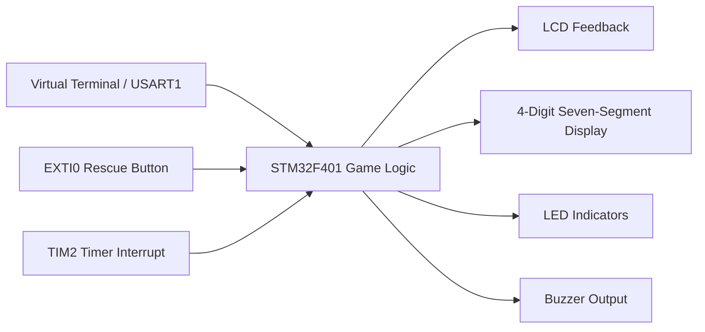
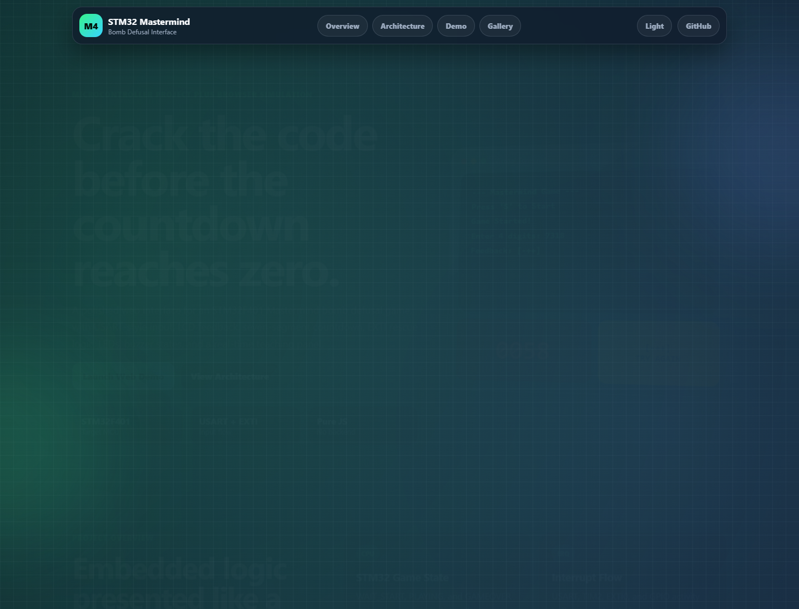
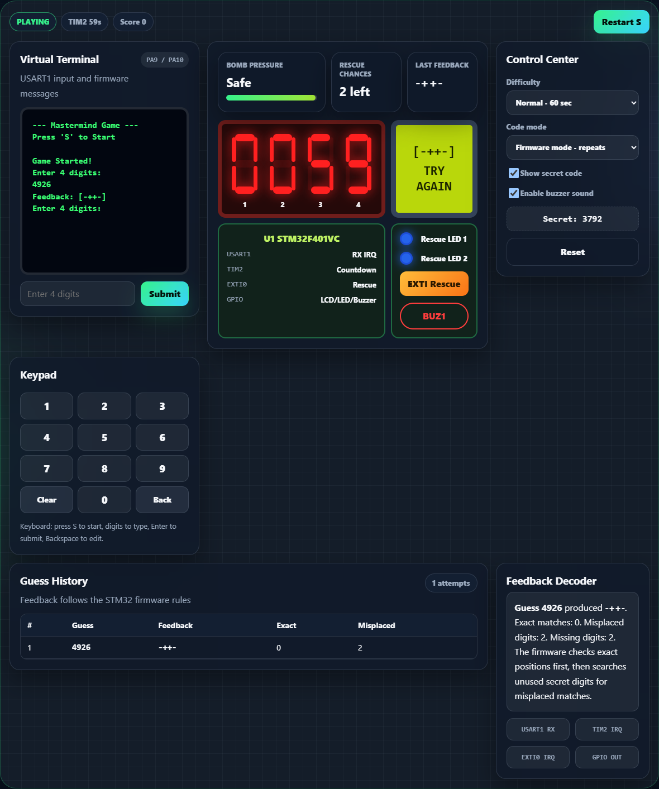

# STM32 Mastermind Game - my little bomb defusal project


This is my microcontroller / microprocessor course project for July 2026. The idea is simple: take the classic Mastermind guessing game, make it feel like a small bomb-defusal challenge, then run it on an STM32F401 with LCD, seven-segment display, LEDs, buzzer, serial terminal, timer interrupt, and an external rescue button.

Why this project? Well, I wanted something more interesting than only blinking LEDs. Blinking LEDs is fine, but after a while it gets boring, honestly. So basically this project became a mix of game logic + embedded peripherals + Proteus simulation + a frontend web demo so it can be shown without opening STM32CubeIDE every time.

The GitHub repo is here:

[https://github.com/mohadesehesmaeilzadeh/stm32-mastermind-game](https://github.com/mohadesehesmaeilzadeh/stm32-mastermind-game)

## What the game does, in normal words

When the game starts, the STM32 creates a secret 4-digit code. The player enters guesses through the serial terminal. After each guess, the LCD and terminal show feedback using three symbols:

| Symbol | Meaning |
|---|---|
| `*` | right digit, right place |
| `+` | right digit, wrong place |
| `-` | this digit is not in the code |

For example, if the secret code is `3479` and the player enters `3456`, some digits may be correct, some may be in the wrong place, and some are just not useful. The goal is to understand the feedback and solve the code before the timer reaches zero.

There is also a rescue button connected to an external interrupt. First press adds 15 seconds, second press adds 5 seconds, and after that it doesn't help anymore. The LEDs show those chances visually. If time runs out, the buzzer turns on and the game is over. If the guess is correct, the game prints the win message.

## Hardware / simulation preview

Here is the Proteus simulation while the game is running:


And this one is the win state:


## How the STM32 parts talk to each other

This was the part where I had to think a bit. The project is not just "read input and print output". Different microcontroller parts have their own job.



The same idea without the diagram:

```text
Serial Terminal --> USART1 interrupt/input --> Game logic
                                             |
EXTI button ------> Rescue interrupt --------+
                                             |
TIM2 timer -------> Countdown / display -----+
                                             |
                                             +--> LCD, LEDs, buzzer
```

The USART part is used for starting the game and entering guesses. TIM2 handles the countdown and keeps the display updated. GPIO pins drive the LCD, seven-segment display, LEDs, and buzzer. EXTI0 is used for the rescue button. It sounds clean now, but to be fair interrupt timing can get weird fast if you put too much work inside callbacks.

## Main firmware behavior

The firmware has three main states:

| State | What happens |
|---|---|
| `STATE_WAIT_START` | waits for `S` or `s` from the terminal |
| `STATE_PLAYING` | accepts 4-digit guesses and updates the game |
| `STATE_GAMEOVER` | shows win/loss result and waits for restart |

The feedback algorithm checks exact matches first, then checks the remaining digits for wrong-position matches. This avoids counting the same digit twice. That little detail matters more than it looks at first.

## Pin connections I used

| Part | STM32 pin(s) | Job |
|---|---|---|
| USART1 TX/RX | PA9 / PA10 | virtual terminal |
| LCD RS | PC0 | LCD register select |
| LCD EN | PC1 | LCD enable |
| LCD D4-D7 | PC2-PC5 | LCD 4-bit data |
| Seven-segment segments | PE9-PE15 | segment outputs |
| Seven-segment digit enables | PB8, PB9, PB10, PB12 | digit selection |
| Rescue button | PE0 | EXTI0 interrupt input |
| LED 1 | PD12 | first rescue chance |
| LED 2 | PD13 | second rescue chance |
| Buzzer | PD11 | timeout / danger output |

Note to self: grounding inputs properly saves a lot of pain. Floating buttons can make debugging feel haunted.

## The code and folders

The repository is arranged like this:

```text
.
|-- docs/
|   |-- Final_Project.pdf
|   `-- images/
|       |-- proteus-game-start.png
|       `-- proteus-win-state.png
|-- firmware/
|   `-- Mastermind_Game/
|       |-- Core/
|       |-- Drivers/
|       |-- Mastermind_Game.ioc
|       `-- STM32F401VCTX_FLASH.ld
|-- simulation/
|   `-- FINAL_PROJECT.pdsprj
|-- web_demo/
|   |-- assets/
|   |   |-- gallery/
|   |   `-- screenshots/
|   |       |-- screenshot-demo.png
|   |       `-- screenshot-latest.png
|   |-- scripts/
|   |   `-- capture-screenshot.mjs
|   |-- index.html
|   |-- package.json
|   |-- script.js
|   `-- style.css
|-- .gitignore
`-- README.md
```

Inside the STM32 project, `Core/Src/main.c` is where most of the game logic lives. It handles setup, game state, LCD output, UART messages, timer behavior, and GPIO control. The `Core/Inc` folder has the headers generated by STM32CubeIDE. The `Drivers` folder is the STM32 HAL and CMSIS stuff. I didn't rewrite those because they are generated/library files.

`stm32f4xx_it.c` is mostly interrupt routing, and `stm32f4xx_hal_msp.c` contains the low-level peripheral setup generated by CubeIDE. The linker script `STM32F401VCTX_FLASH.ld` tells the build how flash and RAM are laid out. Not the most exciting file in the world, but if it is wrong, nothing runs, so yeah it matters.

The `simulation/` folder has the Proteus project. The `docs/` folder has the final PDF and images. The `web_demo/` folder is my browser version of the project. It is not required for the STM32 firmware, but it makes the whole thing much easier to explain.

## Web demo

I also made a frontend-only web demo for the same game. No backend, no database, no login, no setup drama. Just HTML, CSS, and JavaScript.

Live Demo:

[https://mohadesehesmaeilzadeh.github.io/stm32-mastermind-game/web_demo/](https://mohadesehesmaeilzadeh.github.io/stm32-mastermind-game/web_demo/)

If GitHub Pages is not enabled yet, the link above may not work until it is turned on from repository settings.





The web version simulates the serial terminal, LCD, seven-segment countdown, rescue button, LEDs, buzzer state, and feedback history. I added a dark/light mode too because presentation screenshots look much better that way. The debug option can reveal the secret code, which is useful when explaining the algorithm in class.

To run it locally:

```bash
cd web_demo
python -m http.server 8080
```

Then open this in the browser:

```text
http://localhost:8080
```

You can also open `web_demo/index.html` directly, but using a tiny local server is usually cleaner.

## STM32CubeIDE setup

Open STM32CubeIDE, import the project from `firmware/Mastermind_Game`, then build it. If you are using Proteus, attach the generated firmware output to the STM32 model if needed and run `simulation/FINAL_PROJECT.pdsprj`.

Serial terminal settings:

| Setting | Value |
|---|---|
| Baud rate | 9600 |
| Data bits | 8 |
| Parity | None |
| Stop bits | 1 |
| Flow control | None |

Once the simulation starts, send `S` to begin, then enter 4-digit guesses. Long story short: if the timer hits zero before you guess correctly, you lose.

## Updating the web screenshots

The README uses fixed screenshot names, so when the design changes I only need to regenerate the images and commit them again.

Install dependencies once:

```bash
cd web_demo
npm install
```

Then capture the new screenshots:

```bash
npm run screenshot
```

The script updates these files:

```text
web_demo/assets/screenshots/screenshot-latest.png
web_demo/assets/screenshots/screenshot-demo.png
```

If Chrome is installed somewhere unusual, set `CHROME_PATH` before running it. On my Windows setup the default Chrome path worked.

## Deploying the web demo

For GitHub Pages, go to the repository on GitHub, open `Settings > Pages`, choose `Deploy from a branch`, select `main`, and use `/root`. After it builds, the web demo should be available at:

```text
https://mohadesehesmaeilzadeh.github.io/stm32-mastermind-game/web_demo/
```

Vercel and Netlify also work. For those, import the GitHub repo and set `web_demo` as the publish directory.

## About the `.gitignore`

I kept a `.gitignore` because embedded projects generate a lot of noisy files. Object files, debug builds, `.elf`, `.hex`, `.map`, Proteus backup files, editor folders, and `web_demo/node_modules/` should not be committed every time. The actual source files, CubeIDE project files, simulation file, screenshots, and documentation stay in the repo.

## Git commands I used

If starting fresh, the basic flow is:

```bash
git init
git branch -M main
git remote add origin https://github.com/mohadesehesmaeilzadeh/stm32-mastermind-game.git
git add .
git commit -m "Initial STM32 Mastermind project"
git push -u origin main
```

For normal updates:

```bash
git status
git add .
git commit -m "Update README and web demo"
git push
```

## Things I would improve next

The project works, but yeah, there are parts I would clean up if I had more time. I would split the firmware into smaller modules like `lcd.c`, `uart.c`, `display.c`, and `game.c` instead of keeping too much inside `main.c`. I would also move heavier LCD/UART work away from interrupt callbacks, because that can become annoying on real hardware.

The seven-segment refresh timing could be tuned better too. In simulation it is okay, but real hardware may need cleaner multiplexing to avoid flicker. Also, the rescue button should have proper debouncing. Button bouncing is one of those tiny things that suddenly wastes an entire evening.

## What I learned

This project helped me understand that microcontroller projects are mostly about coordination. The game logic itself is not super hard, but making the timer, UART input, display, LCD, button interrupt, LEDs, and buzzer all behave together is the real work.

I also learned that simulation is helpful but not magic. Sometimes Proteus makes things look fine, then you realize the code timing still needs attention. And the web demo was a cool extra step because it forced me to explain the embedded system visually, not just write code and hope people understand it.

## Credits

Mohadeseh Esmaeilzadeh.

Made for a microcontroller/microprocessor course using STM32CubeIDE, Proteus, C, HTML, CSS, and JavaScript.
